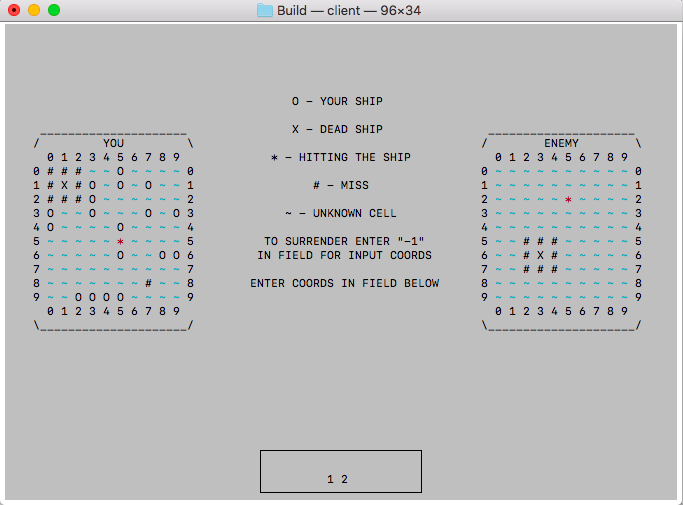

# os_cp
Игра "Морской бой" для двух человек. Подключение по TCP в локальной сети.  
Клиент игры собирать при помощи Makefile'а в папке Build.   
Запускать клиент из той же папки командой "./client".   
Скрин из игры:  
